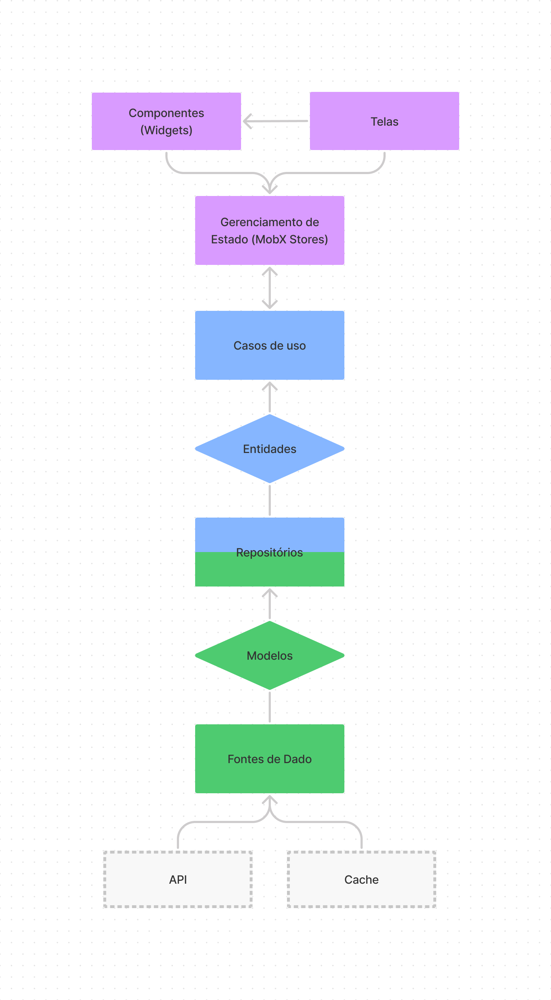
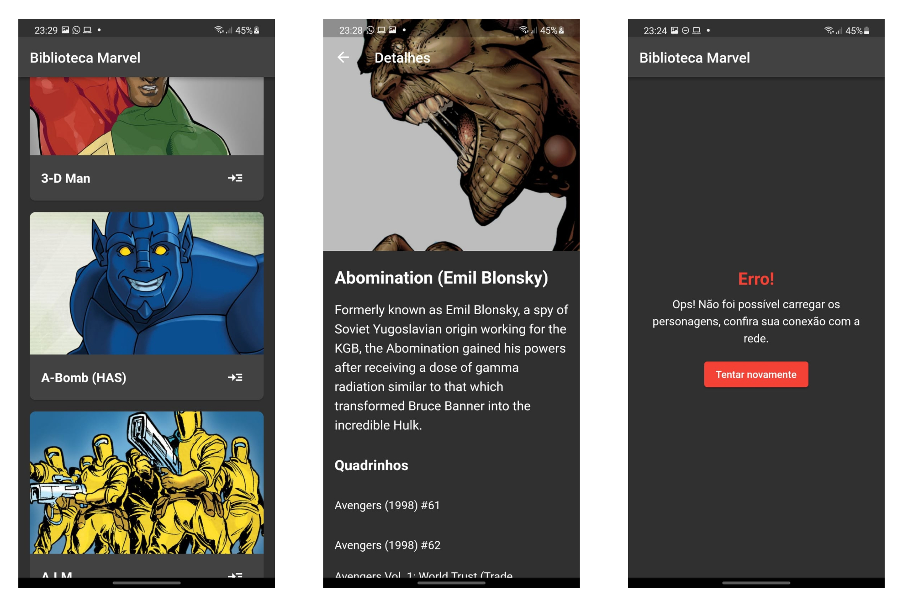

# Marvel Library

Aplicativo escrito em Flutter responsável de listar personagens da editora Marvel e conferir seus detalhes.


## Como testar?

O projeto usa o arquivo `.env` para inserir informações sensíveis da aplicação. Para testar, faça uma conta no site [developer.marvel.com](https://developer.marvel.com/) e insira a chave pública em MARVEL_API_PUBLIC, a chave privada em MARVEL_API_PRIVATE, e a inicial da API (atualmente, http://gateway.marvel.com/v1/public).

Depois disso, use:
```
$ flutter pub get

$ flutter run
```

## Requisitos do Projeto

### Requisitos Funcionais

- Listar personagens com seus respectivos nomes e fotos
- Ver as caracteristicas de um personagem
- Listar os quadrinhos com participação do personagem
  
### Requisitos Não Funcionais

- A lista de personagens deve possuir paginação infinita
- Navegar para o personagem através da lista

## Arquitetura

Foi utilizado *Clean Architecture* para separar as diversas camadas do sistema, mantendo elas desacopladas. Dessa forma, o código é de fácil manutenção e escalável. Essas partes foram separadas da seguinte forma:

| Camada | Responsabilidade | Subcamadas |
|---|---|---|
| Domínio (domain) | Estabelece quais são as entidades do projeto,  quais as ações que podem ser realizadas, e  estabelece um formato padrão para os repositórios de dados. | Entidades (entities),  Casos de Uso (usecases), Repositórios/Estrutura (repository) |
| Dados (data) | Cria as regras para consumo dos dados, o que  inclui: Definir o formato em que as entidades do  sistema serão persistidas, converter os dados  externos para as entidades, implementar os  repositórios da camada de Domínio e determina  quais serão as fontes de dado. | Modelos (models),  Repositórios/Implementação (repository), Fontes de Dados (datasources |
| Apresentação (presentation) | Define a forma como esses dados serão mostrados em tela, através da criação de widgets; e o  gerenciamento de estado. | Telas (screens),  Componentes (widgets),  Estado (stores) |



## Imagens do Projeto



## Testes

- [x] Testes unitários
  - [x] Dominio
  - [x] Dados
  - [ ] Apresentação
- [ ] Testes de integração
- [ ] Testes end-to-end

## TO-DO

- [ ] Implementar a store GetCharacterDetails para retornar mais informações sobre o personagem
- [ ] Criar uma entidade para os quadrinhos, e substituir a lista de titulos por uma lista com imagem e titulo
- [ ] Criar um gerenciamento escalável de navegação
- [ ] Implementar sistema de cache (online-first)